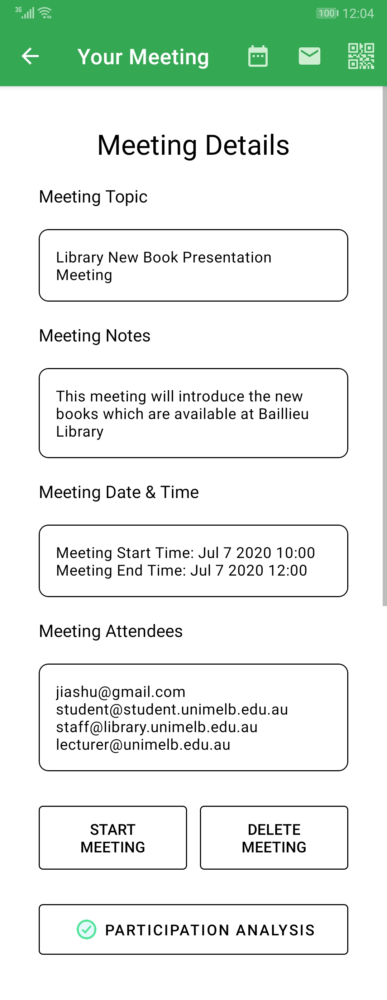

# MeetingTracker (Android App)

## The purpose of the App

MeetingTracker is an Android App which is used to analyze the meeting participation by performing speaker diarization analysis. The user can create a meeting and add the meeting to schedule. The meeting can be shared via e-mail or a meeting QR code so that other meeting participant can join the meeting created by the meeting initiator. During each meeting, the app will automatically analyze the meeting recording and after the meeting ends, display a visualization of each speaker's speaking time and duration. This information can then be used for analyzing purposes. One of the target user group is for the university's library research staffs. 

## Newly designed & optimized

In order to make the app looks stunning and make it publishable onto app stores, 

1. New functionalities added, e.g. meeting sharing, meeting QR code scanning, etc. 
2. The UI has been redesigned using the open source Material Design UI
3. Layout of the user interfaces has been redesigned
4. Comply to the app requirements of app stores, e.g. seek permissions before recording etc. 
5. App behaviour has been optimized
6. User-friendly experience added, e.g. security protection before sharing meeting, email address validity checking, dark mode, etc. 

## App Information

| App Version | Last Update | Apk Download | Source Code Download | 
| ----------- | ----------- | ------------ | -------------------- |
| V 1.0 | June 2020 | [Download App](https://github.com/JiashuWu/MeetingTracker/blob/master/meetingtracker.apk) | [Download Source Code](https://github.com/JiashuWu/MeetingTracker) |

## The App: Main Functionalities & Major User Experience Optimization

[App Welcome Screen](#App-Welcome-Screen)

[User Registration Screen](#User-Registration-Screen)

[User Experience Optimization: Trigger the Correct Keyboard for Different Input Information](#User-Experience-Optimization-Trigger-the-Correct-Keyboard-for-Different-Input-Information)

[User Experience Optimization: User Input Validity Checking](#User-Experience-Optimization-User-Input-Validity-Checking)

[User Experience Optimization: Showable Password Input Field](#User-Experience-Optimization-Showable-Password-Input-Field)

[User Login Screen (Login using Email and Password)](#User-Login-Screen-Login-using-Email-and-Password)

[User Experience Optimization: User Login Account Checking](#User-Experience-Optimization-User-Login-Account-Checking-and-Password-Checking)

[App Home](#App-Home-Display-Upcoming-Meeting-Information---Meeting-Date,-Time-&-Topic)

[App Home - Display Upcoming Meeting Information (Meeting Date, Time, Topic)](#App-Home-Display-Upcoming-Meeting-Information---Meeting-Date,-Time-&-Topic)

[Create Meeting](#Create-Meeting)

[User Experience Optimization: Input Validity Checking when Creating a Meeting](#User-Experience-Optimization-Input-Validity-Checking-when-Creating-a-Meeting)

[Shared the Created Meeting to Attendees via Email](#Share-the-Created-Meeting---Send-Meeting-to-Attendees-via-Email--Add-Meeting-to-Calendar)

[Add Created Meeting to Calendar and Set Notifications](#Share-the-Created-Meeting---Send-Meeting-to-Attendees-via-Email--Add-Meeting-to-Calendar)

[User Experience Optimization: Device User Verification before Sharing the Created Meeting](#User-Experience-Optimization-Share-the-Created-Meeting---Device-User-Verification-before-Sharing-the-Created-Meeting)

[Meeting Schedule (Meeting List)](#Meeting-Schedule-Meeting-List)

[Search for Meeting by Meeting Topic and/or Meeting Notes](#Meeting-Schedule-Meeting-List)

[Filter Meetings by Time](#Meeting-Schedule-Meeting-List)

[Meeting QR Code Scanner (Scan Meeting QR Code to Add Meeting to Calendar)](#Meeting-QR-Code-Scanner-Scan-Meeting-QR-Code-to-Add-Meeting-to-Schedule)

[Meeting Scanner with Flashlight](#Meeting-QR-Code-Scanner-Scan-Meeting-QR-Code-to-Add-Meeting-to-Schedule)

[App Permission Standard - User's Permission to Use Camera Hardware](#App-Permission-Standard---Users-Permission-to-Use-Camera-Hardware)

[Handling Invalid QR Code](#Meeting-QR-Code-Scanner-Scan-Meeting-QR-Code-to-Add-Meeting-to-Schedule)

[View Meeting Details (Meeting Topic, Meeting Notes, Meeting Date & Time, Meeting Attendees)](#View-Meeting-Details)

[Start a Meeting](#View-Meeting-Details)

[Delete a Meeting](#View-Meeting-Details)

[View Meeting Participation Analysis](#View-Meeting-Details)

[Show Meeting QR Code](#View-Meeting-Details)

[User Experience Optimization: Meeting Start Time & Delete Confirmation Dialog](#User-Experience-Optimization-Meeting-Start-Time--Delete-Confirmation-Dialog)

[Meeting Recording Screen](#Meeting-Recorder)

[Meeting Recording Screen Light Mode & Dark Mode](#Meeting-Recorder)

[App Permission Standard: Meeting Recorder - User Permission](#App-Permission-Standard-Meeting-Recorder---User-Permission)

[User Experience Optimization: Avoid Mistakenly Quit the Meeting](#User-Experience-Optimization-Avoid-Mistakenly-Quit-the-Meeting)

[Meeting Result Visualization (Using Diagram)](#Meeting-Result-Visualization)

### Welcome

#### App Welcome Screen

<table style="width:100%">
  <tr>
    <th>The App from Home Screen</th>
    <th>Welcome Screen</th>
  </tr>
  <tr>
    <td align="center"></td>
    <td align="center"></td>
  </tr>
  <tr>
    <td>The app with the newly designed app icon from home screen &nbsp &nbsp &nbsp &nbsp &nbsp &nbsp &nbsp &nbsp &nbsp &nbsp &nbsp &nbsp</td>
    <td>The app welcome screen, with the app icon and version number &nbsp &nbsp &nbsp &nbsp &nbsp &nbsp &nbsp &nbsp &nbsp &nbsp &nbsp &nbsp</td>
  </tr>
</table>

### User Registeration

#### User Registration Screen

<table style="width:100%">
  <tr>
    <th>User Registration Screen</th>
  </tr>
  <tr>
    <td align="center"> &nbsp </td>
  </tr>
  <tr>
    <td>The app's newly designed user registration page &nbsp &nbsp &nbsp &nbsp &nbsp &nbsp &nbsp &nbsp &nbsp &nbsp &nbsp &nbsp &nbsp &nbsp &nbsp &nbsp &nbsp &nbsp &nbsp &nbsp &nbsp &nbsp &nbsp &nbsp &nbsp &nbsp &nbsp &nbsp &nbsp &nbsp &nbsp &nbsp &nbsp &nbsp &nbsp &nbsp &nbsp &nbsp &nbsp &nbsp &nbsp &nbsp &nbsp &nbsp &nbsp &nbsp &nbsp &nbsp &nbsp &nbsp &nbsp &nbsp &nbsp &nbsp &nbsp &nbsp &nbsp &nbsp &nbsp &nbsp &nbsp &nbsp &nbsp &nbsp &nbsp &nbsp &nbsp &nbsp &nbsp &nbsp &nbsp &nbsp &nbsp &nbsp &nbsp &nbsp &nbsp &nbsp &nbsp &nbsp &nbsp &nbsp &nbsp &nbsp &nbsp &nbsp &nbsp &nbsp &nbsp &nbsp</td>
  </tr>
</table>

#### User Experience Optimization: Trigger the Correct Keyboard for Different Input Information

<table style="width:100%">
  <tr>
    <th>User Experience Optimization: Trigger the correct keyboard</th>
  </tr>
  <tr>
    <td align="center"> &nbsp </td>
  </tr>
  <tr>
    <td>User Experience Optimized: The app will automatically trigger the suitable keyboard for better user experience, e.g. trigger email keyboard when typing in email, trigger numerical keyboard when typing in phone number. </td>
  </tr>
</table>

#### User Experience Optimization: User Input Validity Checking

<table style="width:100%">
  <tr>
    <th>User Experience Optimization: Validity Checking</th>
  </tr>
  <tr>
    <td align="center"> &nbsp  &nbsp  &nbsp </td>
  </tr>
  <tr>
    <td>User Experience Optimized: The app will automatically perform validity checking for user inputs like email address, phone number, passwords etc. The validity checking will be performed when the user is typing, and will also be performed after the user clicks the "Register" button. </td>
  </tr>
</table>

#### User Experience Optimization: Showable Password Input Field

<table style="width:100%">
  <tr>
    <th>User Experience Optimization: Showable Password Input Field</th>
  </tr>
  <tr>
    <td align="center"> &nbsp </td>
  </tr>
  <tr>
    <td>User Experience Optimized: The password input field has a show/hide button, which allows the user to view their password after typing. &nbsp &nbsp &nbsp &nbsp &nbsp &nbsp &nbsp &nbsp &nbsp &nbsp &nbsp &nbsp</td>
  </tr>
</table>

### User Login

#### User Login Screen (Login using Email and Password)

<table style="width:100%">
  <tr>
    <th>User Login Screen</th>
  </tr>
  <tr>
    <td align="center"> &nbsp </td>
  </tr>
  <tr>
    <td>The app's newly designed user login page &nbsp &nbsp &nbsp &nbsp &nbsp &nbsp &nbsp &nbsp &nbsp &nbsp &nbsp &nbsp &nbsp &nbsp &nbsp &nbsp &nbsp &nbsp &nbsp &nbsp &nbsp &nbsp &nbsp &nbsp &nbsp &nbsp &nbsp &nbsp &nbsp &nbsp &nbsp &nbsp &nbsp &nbsp &nbsp &nbsp &nbsp &nbsp &nbsp &nbsp &nbsp &nbsp &nbsp &nbsp &nbsp &nbsp &nbsp &nbsp &nbsp &nbsp &nbsp &nbsp &nbsp &nbsp &nbsp &nbsp &nbsp &nbsp &nbsp &nbsp &nbsp &nbsp &nbsp &nbsp &nbsp &nbsp &nbsp &nbsp &nbsp &nbsp &nbsp &nbsp &nbsp &nbsp &nbsp &nbsp &nbsp &nbsp &nbsp &nbsp &nbsp &nbsp &nbsp &nbsp &nbsp &nbsp &nbsp &nbsp &nbsp &nbsp</td>
  </tr>
</table>

#### User Experience Optimization: User Login Account Checking and Password Checking

<table style="width:100%">
  <tr>
    <th>User Experience Optimization: User Login Account Checking</th>
  </tr>
  <tr>
    <td align="center"> &nbsp </td>
  </tr>
  <tr>
    <td>Upon clicking the "Login" button, the app will automatically check whether the user is registered, and will also check the password correctness. Incorrect login will trigger the error messages. </td>
  </tr>
</table>

### App Home

#### App Home (Display Upcoming Meeting Information - Meeting Date, Time & Topic)

<table style="width:100%">
  <tr>
    <th>App Home</th>
  </tr>
  <tr>
    <td align="center"> &nbsp </td>
  </tr>
  <tr>
    <td>This is the newly designed app home screen. If there is no upcoming meeting, the app home will only contain three sections. Otherwise, the top section will show the information of the upcoming meeting, including its 
      <ol>
        <li>Date</li>
        <li>Time</li>
        <li>Topic</li>
      </ol> By clicking this section, the user can then view the details of the meeting and start the meeting. By clicking "Create Meeting", the user can create a new meeting and add it to the schedule, send it to attendees etc. By clicking the "Scan Meeting QR Code", the user can add meetings created by others by scanning the meeting QR code. By clicking the "My Meetings", the user can view his/her meeting schedules. 
    </td>
  </tr>
</table>

### Create Meeting

#### Create Meeting

<table style="width:100%">
  <tr>
    <th colspan="2">Create a Meeting</th>
  </tr>
  <tr>
    <td align="center"></td>
    <td align="center"> &nbsp  &nbsp  &nbsp  &nbsp  &nbsp </td>
  </tr>
  <tr>
    <td colspan="2">This is the newly designed meeting creation page, user needs to present the following information
      <ol>
        <li>Meeting attendees</li>
        <li>Meeting topic</li>
        <li>Meeting notes (optional)</li>
        <li>Meeting Date</li>
        <li>Meeting time</li>
      </ol> After the user selects valid meeting date and time, the app will automatically show how many days, hours and minutes remaining until the start of the meeting. 
    </td>
  </tr>
</table>

#### User Experience Optimization: Input Validity Checking when Creating a Meeting

<table style="width:100%">
  <tr>
    <th>User Experience Optimization: Create a Meeting - Validity Checking</th>
  </tr>
  <tr>
    <td align="center"> &nbsp </td>
  </tr>
  <tr>
    <td>When the user selects the date and time of the meeting, the app will automatically checks the validity of the date & time selection as follows &nbsp &nbsp &nbsp &nbsp &nbsp &nbsp &nbsp &nbsp &nbsp &nbsp &nbsp &nbsp &nbsp &nbsp &nbsp &nbsp &nbsp &nbsp &nbsp &nbsp &nbsp &nbsp &nbsp &nbsp &nbsp &nbsp &nbsp &nbsp &nbsp &nbsp &nbsp &nbsp &nbsp
      <ol>
        <li>The meeting date should be today or after today</li>
        <li>The meeting starting time should be earlier than the meeting ending time</li>
      </ol> If the checking is violated, the corresponding error message will be prompted and the user needs to re-select. 
    </td>
  </tr>
</table>

#### Share the Created Meeting - Send Meeting to Attendees via Email & Add Meeting to Calendar

<table style="width:100%">
  <tr>
    <th>Shared the Created Meeting - Send Meeting to Attendees via Email & Add Meeting to Calendar</th>
  </tr>
  <tr>
    <td align="center"> &nbsp </td>
  </tr>
  <tr>
    <td>The user can choose the following options &nbsp &nbsp &nbsp &nbsp &nbsp &nbsp &nbsp &nbsp &nbsp &nbsp &nbsp &nbsp &nbsp &nbsp &nbsp &nbsp &nbsp &nbsp &nbsp &nbsp &nbsp &nbsp &nbsp &nbsp &nbsp &nbsp &nbsp &nbsp &nbsp &nbsp &nbsp &nbsp &nbsp
      <ol>
        <li>Send meeting to attendees through email, via their prefered email client</li>
        <li>Add meeting to calendar, which also support customized notification</li>
        <li>Generate meeting QR Code, if user choose not to generate a meeting QR code, then this QR code will not be attached in the email</li>
      </ol>
    </td>
  </tr>
</table>

#### User Experience Optimization: Share the Created Meeting - Device User Verification before Sharing the Created Meeting

<table style="width:100%">
  <tr>
    <th>User Experience Optimization: Shared the Created Meeting - Device User Verification</th>
  </tr>
  <tr>
    <td align="center"> &nbsp </td>
  </tr>
  <tr>
    <td>Since the device may be a public device at the library, and the library staff may not want anyone to send an email via this device, therefore, before sending meeting emails and/or adding meeting to calendar, the app will requires the device owner's approval. 
    </td>
  </tr>
</table>

### Meeting Schedule (Meeting List)

#### Meeting Schedule (Meeting List)

<table style="width:100%">
  <tr>
    <th>Meeting Schedule (Meeting List)</th>
  </tr>
  <tr>
    <td align="center"> &nbsp  &nbsp </td>
  </tr>
  <tr>
    <td>User can view their meeting schedule list by clicking the "My Meetings" section on the home page. On the meeting schedule page, they can choose to 
      <ol>
        <li>Create a new meeting by clicking corresponding buttons</li>
        <li>Add a new meeting to schedule via QR code scanning by clicking corresponding buttons</li>
        <li>View the details of a meeting by clicking the meeting</li>
        <li>Delete a meeting</li>
        <li>Search for a meeting by meeting topic and/or meeting notes, support keyword searching & partial matching</li>
        <li>Filter meetings that has ended (Done), or to be started (Todo)</li>
      </ol>
    </td>
  </tr>
</table>

### Meeting QR Code Scanner (Scan to Add Meeting)

#### Meeting QR Code Scanner: Scan Meeting QR Code to Add Meeting to Schedule

<table style="width:100%">
  <tr>
    <th>Meeting QR Code Scanner: Scan Meeting QR Code to Add Meeting to Schedule</th>
  </tr>
  <tr>
    <td align="center"> &nbsp  &nbsp  &nbsp </td>
  </tr>
  <tr>
    <td>For better user experience, this app allow the user to choose whether to generate a meeting QR code for each meeting he/she creates. Other user can then add this meeting to their own schedule by simply scanning the meeting QR code. If the scanned QR code is not a valid meeting QR code, an error message will be prompted. Furthermore, a flashlight button is added onto the scanner activity to make the app capable to use at night. </td>
  </tr>
</table>

#### App Permission Standard - User's Permission to Use Camera Hardware

<table style="width:100%">
  <tr>
    <th>App Permission Standard - User's Permission to Use Camera Hardware</th>
  </tr>
  <tr>
    <td align="center"></td>
  </tr>
  <tr>
    <td>To comply with the requirements for popular app stores like Google Play Store and Samsung App Store etc, the app needs to ask for permission before using hardwares like camera. </td>
  </tr>
</table>

### View Meeting Details

#### View Meeting Details

<table style="width:100%">
  <tr>
    <th>View Meeting Details</th>
  </tr>
  <tr>
    <td align="center"> &nbsp </td>
  </tr>
  <tr>
    <td>User can do the following
      <ol>
        <li>View the meeting details, including meeting topic, meeting notes, meeting date & time, meeting attendees</li>
        <li>Start the meeting if the meeting hasn't been started. The app will double confirm with the user if the meeting is not due to be started, i.e. to early or to late</li>
        <li>Delete the meeting</li>
        <li>View the meeting participation analysis, if the meeting has been completed. A clock icon means the meeting analysis is not available, a green tick icon means the meeting analysis is available. </li>
        <li>Add the meeting to system calendar</li>
        <li>Send the meeting information to attendees via email</li>
        <li>Show meeting QR code</li>
      </ol>
    </td>
  </tr>
</table>

#### User Experience Optimization: Meeting Start Time & Delete Confirmation Dialog

<table style="width:100%">
  <tr>
    <th>User Experience Optimization: helper messages</th>
  </tr>
  <tr>
    <td align="center"> &nbsp </td>
  </tr>
  <tr>
    <td>User can do the following
      <ol>
        <li>Start the meeting if the meeting hasn't been started. The app will double confirm with the user if the meeting is not due to be started, i.e. to early or to late</li>
        <li>Upon clicking the "Delete Meeting" button, double check with the user to avoid mistakenly delete a meeting</li>
      </ol>
    </td>
  </tr>
</table>

### Meeting Recorder

#### Meeting Recorder

<table style="width:100%">
  <tr>
    <th>Meeting Recorder</th>
  </tr>
  <tr>
    <td align="center"> &nbsp  &nbsp </td>
  </tr>
  <tr>
    <td>The meeting recorder display the following components: 
      <ol>
        <li>The meeting topic</li>
        <li>The meeting timer</li>
        <li>A "Play" button, after clicking, it will become a "Stop" button</li>
        <li>A light/dark mode switcher</li>
      </ol> The meeting recorder supports two modes: light mode and dark mode. Both of them can be useful. Support that a presenter may need to turn off all the lights in the presentation room to achieve a better presentation effect, in this case, a dark mode of the application will make it less distracting under the dark environment. After the meeting finishes, the meeting recorder will inform the user that the meeting participation analysis will become available soon and where to view it. 
    </td>
  </tr>
</table>

#### App Permission Standard: Meeting Recorder - User Permission

<table style="width:100%">
  <tr>
    <th>App Permission Standard: Meeting Recorder - User Permission</th>
  </tr>
  <tr>
    <td align="center"></td>
  </tr>
  <tr>
    <td>To comply with the requirement of the App Stores, upon the user clicking the "Start Meeting" button, if the permission is not yet granted, the app will seek for "record audio" permission from the user. </td>
  </tr>
</table>

#### User Experience Optimization: Avoid Mistakenly Quit the Meeting

<table style="width:100%">
  <tr>
    <th>User Experience Optimization: Avoid mistakenly quit the meeting</th>
  </tr>
  <tr>
    <td align="center"></td>
  </tr>
  <tr>
    <td>To enhance the user experience and avoid the user mistakenly quit the meeting, the app will prompt a dialog which tells the user that quitting the meeting is not allowed before the user ends the meeting. </td>
  </tr>
</table>

### Meeting Result Visualization

#### Meeting Result Visualization

<table style="width:100%">
  <tr>
    <th>Meeting Result Visualization</th>
  </tr>
  <tr>
    <td align="center"></td>
  </tr>
  <tr>
    <td>Finally, after the meeting is finished, the user can view the meeting participation analysis by clicking the "Participation Analysis" button in the Meeting Details page. The green tick on the button indicates that the analysis is viewable. The analysis will show a diagram which tells which user start and stops talking at which time. </td>
  </tr>
</table>

